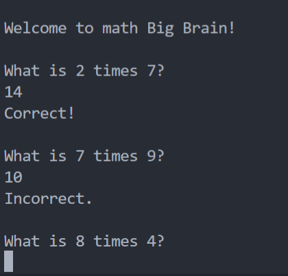
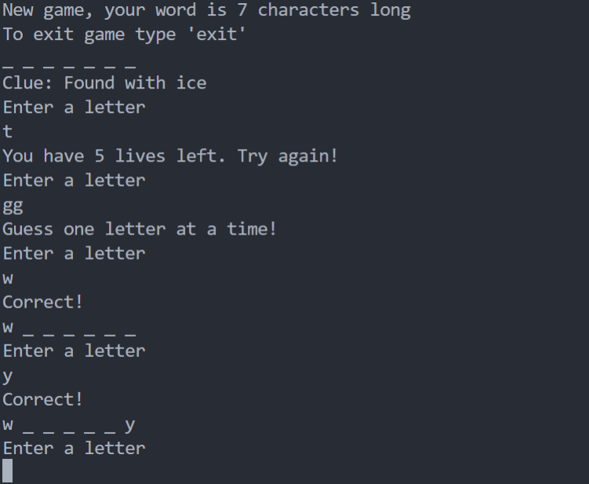

# Big Brain App
### Ruby teminal app
GitHub Link: https://github.com/patjd0/PatrickDanenas_T1A3

## App Description:
This is a brain training app designed to get you out of the brain foggy state. This app tests you with its three main features, a math test, a trivia quiz and a game of good old fashion hangman. These games will give you a final score that will be tallied into an overall user score for you to improve upone.

## Functionality

####  User & Menu:
- Upon commencing the application, the user will be asked to provide a few simple details. Name and Age, from this point  it will bring the user to the main menu. This page will display three game choices, Math, Hangman and Trivia along with the name of the user and overall scores.

#### Math Game
- This game asks ten random multiplication questions, tallying up a score out of ten and adding it to the users overall score.

#### Hangman
- This game is the same game you played as a kid in school. you are given a hint as to what the word is and number of letters, you are also displayed with a teaser of the number of characters along with correct letters.  
